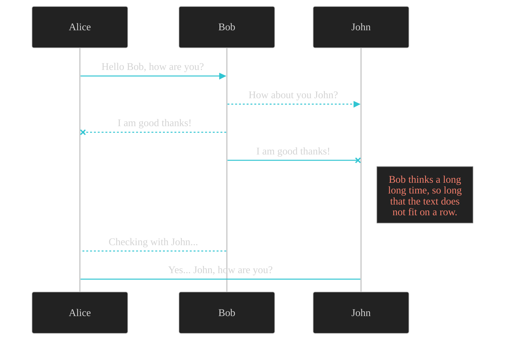

# H1 Header

## Image Placeholder


## H2 Header Example

This is a paragraph under an H2 header.

### H3 Header Example

This is a paragraph under an H3 header.

#### H4 Header Example

This is a paragraph under an H4 header.

## Code Block Placeholder

```python
def hello_world():
    print("Hello, World!")
    return True
```

```bash
echo "This is a bash example"
ls -la
```

## Mermaid Diagram Placeholder



## Warning Box Placeholder

> **⚠️ Warning**
> 
> This is a warning message. Use this for important cautionary information.

## Info Box Placeholder

> **ℹ️ Info**
> 
> This is an informational message. Use this for helpful tips or additional context.

## Lists

### Unordered List
- First item
- Second item
- Third item
  - Nested item
  - Another nested item

### Ordered List
1. First step
2. Second step
3. Third step

## Inline Code

You can use `inline code` like this in your paragraphs.

## Links

[Link to example](https://example.com)

