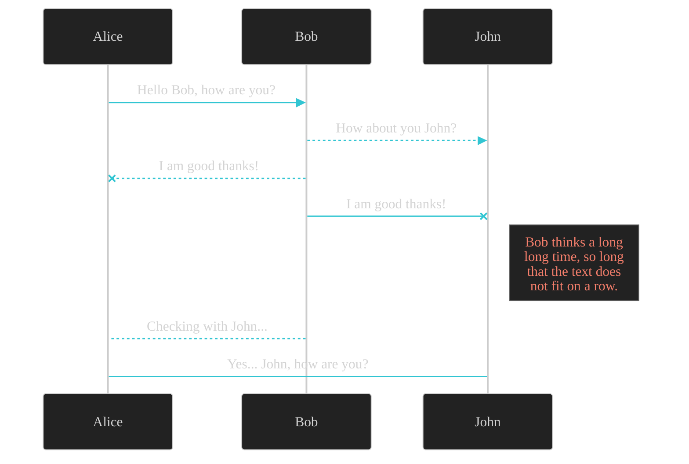
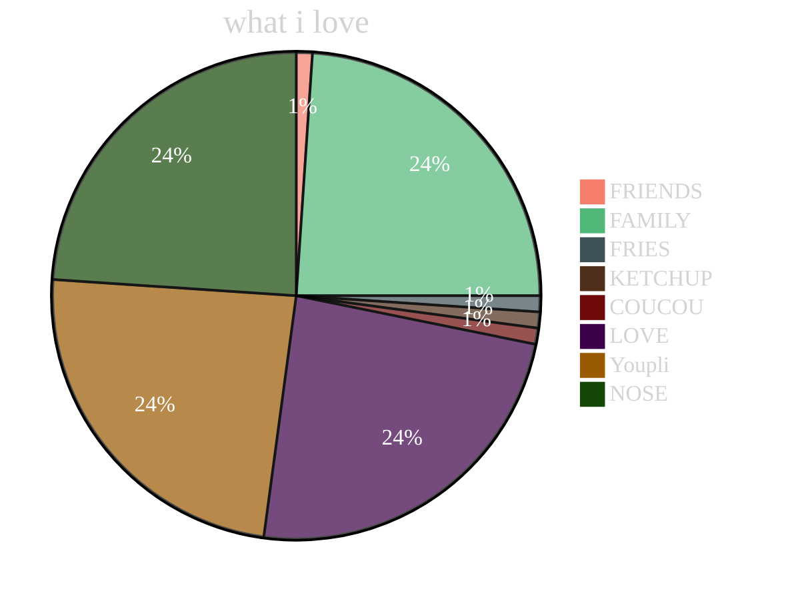
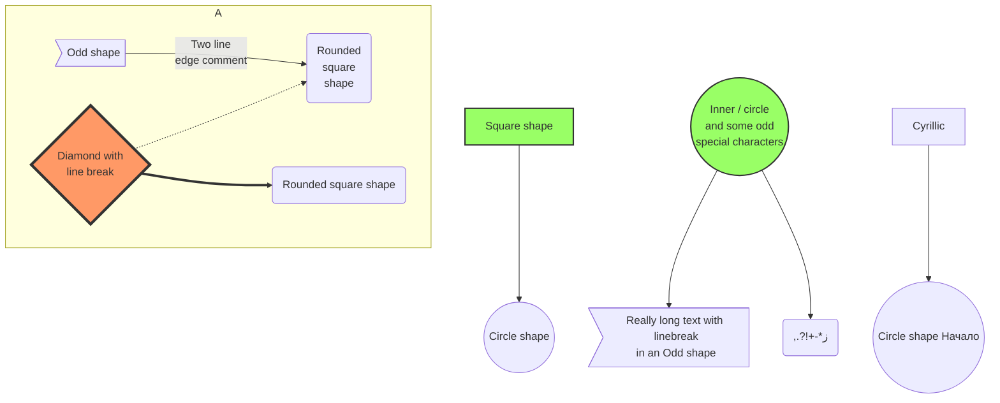
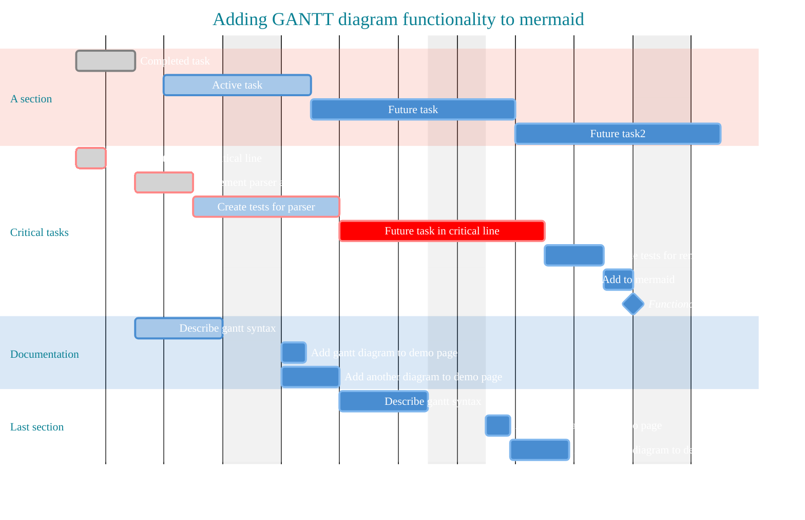
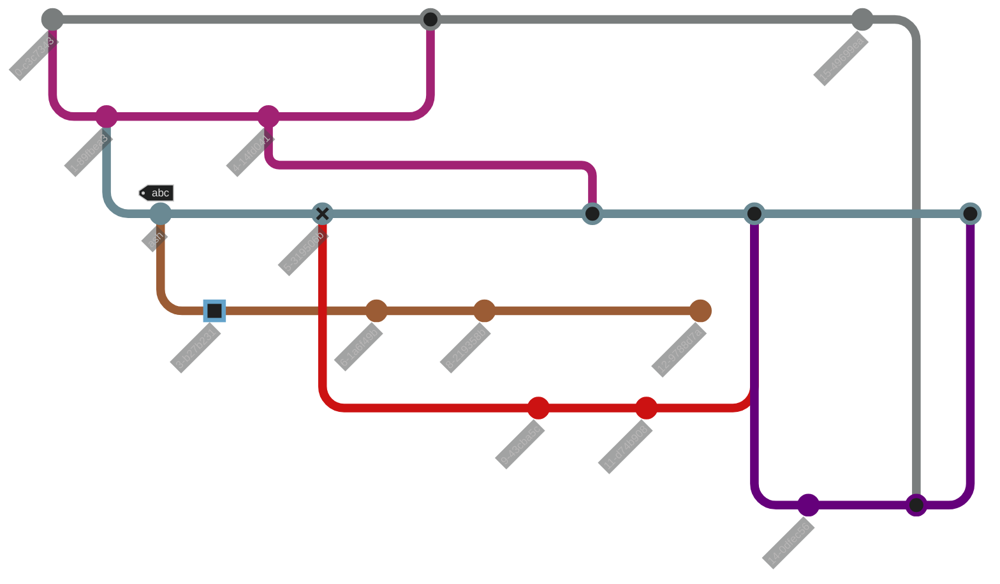

## Architecture

```mermaid
---
config:
  theme: 'dark'
  themeVariables:
    darkMode: true
    background: '#222222'     
    mainBkg: '#222222'            
    primaryColor: '#222222'       
    primaryTextColor: '#FFFFFF'  
    primaryBorderColor: '#32C5D2' 
    secondaryColor: '#7FB6ED'    
    secondaryBorderColor: '#7FB6ED'
    lineColor: '#666666'   
    textColor: '#FFFFFF'   
    noteBkgColor: '#222222'   
    noteTextColor: '#F57F6C'  
    noteBorderColor: '#666666'   
    activationBkgColor: '#F57F6C' 
    activationBorderColor: '#FCB5AA'
    signalColor: '#32C5D2'  
    fontFamily: 'JetBrains Mono'
    fontSize: '14px'
---
sequenceDiagram
    Alice ->> Bob: Hello Bob, how are you?
    Bob-->>John: How about you John?
    Bob--x Alice: I am good thanks!
    Bob-x John: I am good thanks!
    Note right of John: Bob thinks a long<br/>long time, so long<br/>that the text does<br/>not fit on a row.

    Bob-->Alice: Checking with John...
    Alice->John: Yes... John, how are you?
```

```mermaid
---
config:
  theme: 'dark'
  themeVariables:
    darkMode: true
    background: '#222222'     
    mainBkg: '#222222'            
    primaryColor: '#222222'       
    primaryTextColor: '#FFFFFF'  
    primaryBorderColor: '#32C5D2' 
    secondaryColor: '#7FB6ED'    
    secondaryBorderColor: '#7FB6ED'
    lineColor: '#666666'   
    textColor: '#FFFFFF'   
    noteBkgColor: '#222222'   
    noteTextColor: '#F57F6C'  
    noteBorderColor: '#666666'   
    activationBkgColor: '#F57F6C' 
    activationBorderColor: '#FCB5AA'
    signalColor: '#32C5D2'  
    fontFamily: 'JetBrains Mono'
    fontSize: '14px'
    pie1: '#F57F6C'
    pie2: '#52B87A'
---

pie title what i love
         "FRIENDS" : 2
         "FAMILY" : 45
         "FRIES" : 2
         "KETCHUP" : 2
         "COUCOU" : 2
         "LOVE" : 45
         "Youpli" : 45
         "FAMILY" : 45
         "NOSE" : 45
```

```mermaid
graph TB
    sq[Square shape] --> ci((Circle shape))

    subgraph A
        od>Odd shape]-- Two line<br/>edge comment --> ro
        di{Diamond with <br/> line break} -.-> ro(Rounded<br>square<br>shape)
        di==>ro2(Rounded square shape)
    end

    %% Notice that no text in shape are added here instead that is appended further down
    e --> od3>Really long text with linebreak<br>in an Odd shape]

    %% Comments after double percent signs
    e((Inner / circle<br>and some odd <br>special characters)) --> f(,.?!+-*ز)

    cyr[Cyrillic]-->cyr2((Circle shape Начало));

     classDef green fill:#9f6,stroke:#333,stroke-width:2px;
     classDef orange fill:#f96,stroke:#333,stroke-width:4px;
     class sq,e green
     class di orange

```

```mermaid
---
config:
  theme: 'base'
  themeVariables:
    darkMode: true
    background: '#222222'
    mainBkg: '#000000'
    primaryColor: '#498DD1'
    primaryTextColor: '#FFFFFF'
    primaryBorderColor: '#7FB6ED'
    secondaryColor: '#52B87A'
    secondaryBorderColor: '#91D4A8'
    tertiaryColor: '#F57F6C'
    tertiaryBorderColor: '#FCB5AA'
    lineColor: '#666666'
    textColor: '#FFFFFF'
    noteBkgColor: '#D99530'
    noteTextColor: '#000000'
    noteBorderColor: '#E9BE74'
    fontFamily: 'JetBrains Mono'
    fontSize: '16px'
---
gantt
    dateFormat  YYYY-MM-DD
    title       Adding GANTT diagram functionality to mermaid
    excludes    weekends
    %% (`excludes` accepts specific dates in YYYY-MM-DD format, days of the week ("sunday") or "weekends", but not the word "weekdays".)

    section A section
    Completed task            :done,    des1, 2014-01-06,2014-01-08
    Active task               :active,  des2, 2014-01-09, 3d
    Future task               :         des3, after des2, 5d
    Future task2              :         des4, after des3, 5d

    section Critical tasks
    Completed task in the critical line :crit, done, 2014-01-06,24h
    Implement parser and jison          :crit, done, after des1, 2d
    Create tests for parser             :crit, active, 3d
    Future task in critical line        :crit, 5d
    Create tests for renderer           :2d
    Add to mermaid                      :until isadded
    Functionality added                 :milestone, isadded, 2014-01-25, 0d

    section Documentation
    Describe gantt syntax               :active, a1, after des1, 3d
    Add gantt diagram to demo page      :after a1  , 20h
    Add another diagram to demo page    :doc1, after a1  , 48h

    section Last section
    Describe gantt syntax               :after doc1, 3d
    Add gantt diagram to demo page      :20h
    Add another diagram to demo page    :48h
```

```mermaid
---
config:
  logLevel: 'debug'
  theme: 'dark'
  gitGraph:
    showBranches: false
---
      gitGraph
        commit
        branch hotfix
        checkout hotfix
        commit
        branch develop
        checkout develop
        commit id:"ash" tag:"abc"
        branch featureB
        checkout featureB
        commit type:HIGHLIGHT
        checkout main
        checkout hotfix
        commit type:NORMAL
        checkout develop
        commit type:REVERSE
        checkout featureB
        commit
        checkout main
        merge hotfix
        checkout featureB
        commit
        checkout develop
        branch featureA
        commit
        checkout develop
        merge hotfix
        checkout featureA
        commit
        checkout featureB
        commit
        checkout develop
        merge featureA
        branch release
        checkout release
        commit
        checkout main
        commit
        checkout release
        merge main
        checkout develop
        merge release
```
```mermaid

```
```mermaid

```
